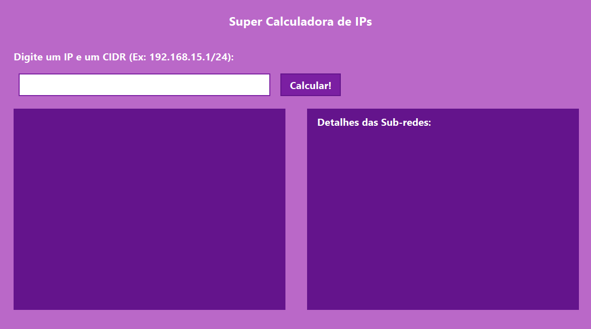

# Calculadora de IPs

Calculadora de IPs desenvolvida para o curso de desenvolvimento de sistemas da escola SENAI Jandira

## Tecnologias
* JAVA
* Markdown
* git
* github

## Autor
[Gabriel José](https://www.linkedin.com/in/gabriel-jos%C3%A9-a4711a312/)
